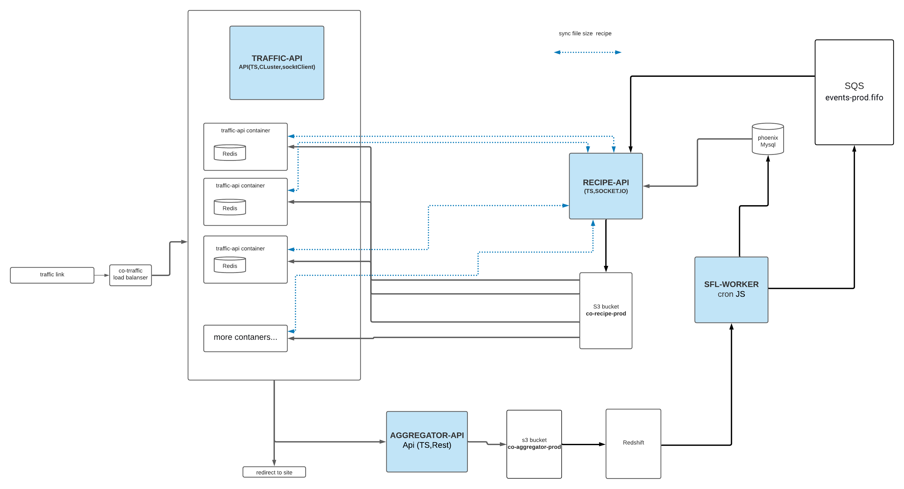

### aggregator-api
1. Collect data in GZ File format 
2. Send GZ files to S3 
3. Send from S3 to Redshift 

### S3
```dotenv
bucket=aggregator-615453596326
```

### redshift
```dotenv
host=redshift.jatun.systems 
database=traffic_data
scemas=advertiser_events
table=traffic
```
    

### Docker setup
	docker build -t aggragator-api .
	docker run -it -p 3002:3002 --rm --name aggragator-api-  aggragator-api

### run
    npm run dev

### build
    npm run build

### env example
```dotenv
HOST=localhost
PORT=9002
NODE_ENV = development
FOLDER_LOCAL = unprocessed_json
#EX local dir_current = /home/miroshnykov/Sites/co-aggragator/unprocessed_json
AWS_ACCESS_KEY_ID=
AWS_SECRET_ACCESS_KEY=
AWS_REGION=us-east-1

S3_BUCKET_NAME = co-aggregator-staging

REDSHIFT_HOST = 
REDSHIFT_USER = 
REDSHIFT_PORT = 5439
REDSHIFT_PASSWORD = 
REDSHIFT_DATABASE = 
```

### nodeJs v16 
####New in Node.js: node: protocol imports

    import * as fs from 'node:fs';
    https://nodejs.org/api/esm.html#node-imports

# diagram

